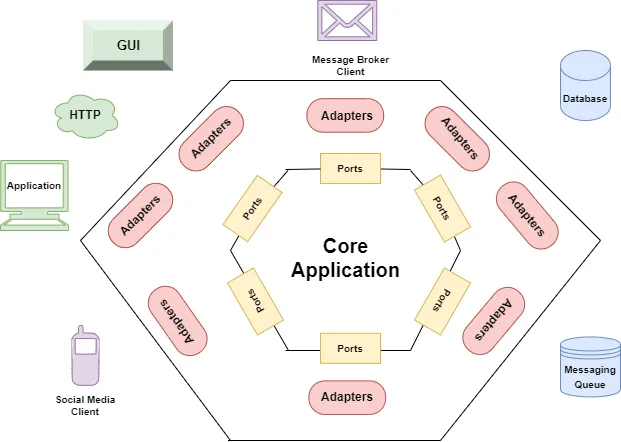

# ECG (electrocardiograms) service

This repository contains the code of a microservice that allows users to register or store ECGs for processing,
and then query various insights about them, such as the number of zero crossings of the signal.

## Description

The project is built using Python + FastAPI stack, following _**Hexagonal**_
(also known as _**Ports and Adapters**_) architectural style and a simplistic approach of the CQRS pattern.

In the following
image ([source](https://betterprogramming.pub/a-quick-and-practical-example-of-hexagonal-architecture-in-java-8d57c419250d)),
we can see a diagram representing the different parts that may for a
system following this architecture design:



The directory structure for each feature (ECGs, Insights and Users) is as follows:

- [src](src) &rarr; main package with all the source code.
    - [feature] &rarr; package with all the code related to the feature.
        - [adapter] &rarr; implementations of the interfaces (ports) that communicate with the
          application core.
          There are two types of adapters:
            - *in_adapters* &rarr; they are implementations of external systems that communicate *inwards* with the
              application, such as HTTP, etc.
            - *out_adapters* &rarr; they are implementations of external system that communicate *outwards* with the
              application, such as databases, etc.
        - [application] &rarr; interfaces and implementation of *use cases*.
            - [ports] &rarr; interfaces and use cases that adapters and services implement for
              communication with the application core. There are two types as well, *in_ports* and *out_ports*,
              following the same logic as with adapters.
            - [service] &rarr; implementation of *use cases* .
        - [domain] &rarr; main domain model and business logic of the application.


**Note**: To simplify development, only *in memory* persistence adapters have been implemented.
For adding any other solution, it's as simple as implementing a new adapter for it (PostgreSQL, Mongo, Redis, etc.)
and changing the dependency in the service that requires it.

### Endpoints

There are three main endpoints that the app implements + a health endpoint:

* `GET /health/ping` &rarr; to check if the app is alive.
* `POST /users` &rarr; for registering new users. Example:
    ```shell
    curl --location 'http://0.0.0.0:8000/users' \
    --header 'x-admin-token: secret' \
    --header 'Content-Type: application/json' \
    --data '{
      "username": "user"
    }'
    ```
* `POST /ecgs`: &rarr; to register a new ECG. Example:
    ```shell
    curl --location 'http://0.0.0.0:8000/ecgs' \
    --header 'x-user-token: <GENERATED_USER_TOKEN>' \
    --header 'Content-Type: application/json' \
    --data '{
        "leads": [
            {
                "name": "I",
                "number_of_samples": 8,
                "signal": [1, 0, -1, 0, 1, 0, 0, 1]
            }
        ]
    }'
    ```
* `GET /ecgs/<ecg-id>/insights` &rarr; to retrieve insights for an existing ECG. Example:
    ```shell
    curl --location 'http://0.0.0.0:8000/ecgs/<ECG_ID>/insights' \
    --header 'x-user-token: <GENERATED_USER_TOKEN>'
    ```


The details of the endpoint's contract can also be found at the [autogenerated API docs](http://127.0.0.1:8000/docs),
once the app is deployed.

## Running

### With Docker
```shell
docker build --target deploy -t idoven-backend-challenge .

docker run -p 8000:8000 --rm --name idoven-backend-challenge-local-deploy idoven-backend-challenge
```

### Locally

* Install Python 3.11. You can use [pyenv](https://github.com/pyenv/pyenv?tab=readme-ov-file#installation)
  to install the required Python version.

```shell
pyenv install 3.11.7
```

* Set it up as the global version.

```shell
pyenv global 3.11.7
```

* Create the virtual environment with the [pyenv virtualenv plugin](https://github.com/pyenv/pyenv-virtualenv).

```shell
pyenv virtualenv 3.11.7 idoven-venv-3.11.7
```

* Activate it

```shell
pyenv activate idoven-venv-3.11.7
```

* Install the dependencies

```shell
pip install -r requirements.txt
```

* Launch the app using the built-in uvicorn server

```shell
uvicorn src.main:app --port 8000 --reload
```

or by executing the launch script

```shell
chmod u+x run.sh

./run.sh
```

* When done, you can clean the virtual environment using the following commands

```shell
pyenv deactivate

pyenv uninstall idoven-venv-3.11.7
```

## Testing

### With Docker
```shell
docker build --target run_tests -t idoven-backend-challenge-tests .

docker run --rm --name idoven-backend-challenge-tests-execution idoven-backend-challenge-tests
```

### Locally
After installing dependencies, just run pytest to execute the tests.

```shell
pytest -v --cov tests
```
